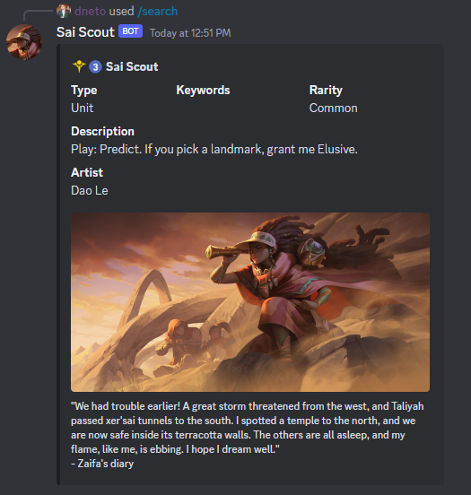

# Sai Scout

## Table of Contents

- [Sai Scout](#sai-scout)
  - [Table of Contents](#table-of-contents)
  - [Overview](#overview)
  - [Commands](#commands)
    - [`/deck`](#deck)
    - [`/search` (BETA)](#search-beta)
  - [Contributing](#contributing)
  - [Roadmap](#roadmap)

## Overview

Sai Scout is a Discord bot for showing deck cards in a visual way.

[Invite Link](https://discord.com/api/oauth2/authorize?client_id=1086224659231559680&permissions=0&scope=bot)

The story behind this name starts [G.G Lookout](https://github.com/CuriouserThing/GreengladeLookout), which is another
bot that inspired this one.

Green Glade Lookout uses a spyglass, so I thought it would be a good idea to
name this bot as another card that uses a spyglass too.

## Commands

### `/deck`

Shows the list of all cards from the deck represented by the code. It shows the
deck code as a title and the cards splitted by types into embed fields

**Options**

- `code`: Deck code

Screenshot

### `/search` (BETA)

Shows details like region, cost, name, keywords, description, artist, card art, flavor...

**Options**

- `name`: Card name (autocomplete).

Screenshot

## Contributing

Fell free to contribute with suggestions and code!

## Roadmap

 - Add a command to view info by card name