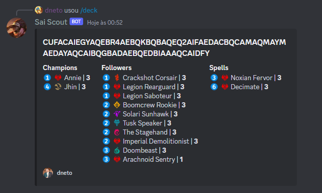
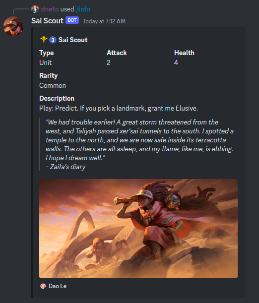

# Sai Scout

## Table of Contents

- [Sai Scout](#sai-scout)
  - [Table of Contents](#table-of-contents)
  - [Overview](#overview)
  - [Commands](#commands)
    - [`/deck`](#deck)
    - [`/info`](#info)
    - [`/config`](#config)
      - [`/config language` Sets the default language for the current server](#config-language-sets-the-default-language-for-the-current-server)
      - [`/config website` Configures the website in the "View in" button in `/deck` command](#config-website-configures-the-website-in-the-view-in-button-in-deck-command)
  - [Contributing](#contributing)

## Overview

Sai Scout is a Discord bot for showing [**Legends of Runeterra**](https://playruneterra.com/) decks in a visual way.

[Invite Link](https://discord.com/api/oauth2/authorize?client_id=1086224659231559680&permissions=0&scope=bot)

The story behind this name starts [G.G Lookout](https://github.com/CuriouserThing/GreengladeLookout)
which is another bot that inspired this one.

Green Glade Lookout uses a spyglass, so I thought it would be a good idea to
name this bot as another card that uses a spyglass too.

## Commands

### `/deck`

Shows the list of all cards from the deck represented by the code. It shows the
deck code as a title and the cards splitted by types into embed fields

**Options**

- **code**: Legends of Runeterra deck code
- **(optional) language**: Language which the output must be showed. If this
  option is not set, the output will be in english.

Screenshot

### `/info`

Shows details like region, cost, name, keywords, description, artist, card art, flavor...

**Options**

- **name**: Card name (autocomplete).
- **(optional) language**: Language which the output must be showed. If this
  option is not set, the output will be in english.

Screenshot

### `/config`

> ⚠️ These commands are only available to users with "Manage Server" permissions

#### `/config language` Sets the default language for the current server

**Options**

- **language**: Language which the output of commands must be showed.

#### `/config website` Configures the website in the "View in" button in `/deck` command

**Options**

- **template**: Template for the site that will show the deck. Example:
  https://runeterra.ar/decks/code/{{code}}
- **label**: The name of the website to be shown in the button

## Contributing

Fell free to contribute with suggestions and code!