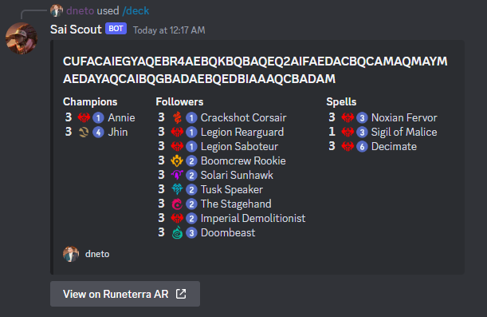

# Sai Scout

## Overview

Sai Scout is a Discord bot for showing deck cards in a visual way.

[Invite Link](https://discord.com/api/oauth2/authorize?client_id=1086224659231559680&permissions=0&scope=bot)

The story behind this name starts [G.G Lookout](https://github.com/CuriouserThing/GreengladeLookout), which is another
bot that inspired this one.

Green Glade Lookout uses a spyglass, so I thought it would be a good idea to
name this bot as another card that uses a spyglass too.

## Commands

- `/deck <code>`: Shows the list of all cards from the deck represented by the
  code. It shows the deck code as a title and the cards splitted by types into
  embed fields (like the image below). 

## Contributing

Fell free to contribute with suggestions and code!

## Roadmap

 - Add a command to view info by card name